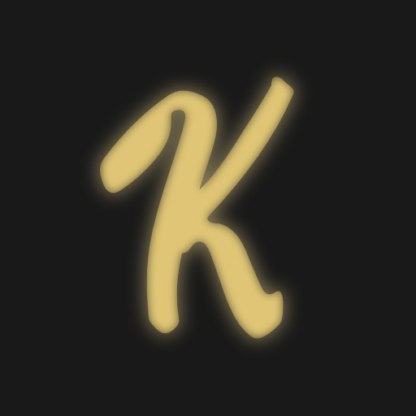

# Kauna

Kauna on Realmi.fi palveinta varten luotu QOL modi, jolla saat tällä hetkellä pelkästään jotain Parkour duels ominaisuuksia.

Kauna ei anna yhtään etua muihin pelaajiin verrattuna, lisää vain elämänlaatua parantavia asioita.

---

---

### 📥 Lataus

Lataus ei ole mahdollista tällä hetkellä, koska en osaa koodaa ja ei tää oo vielä valmis.

### 🖥️ Käyttöohjeet

Vaatii Fabric Apin, lataa se.

### 📃 Modin Toiminta

Kauna lisää:  
Parkouriin pelin loppuessa "Voittaja" tekstin alle erotuksen parhaasta ajasta, aika jonka sait ja erotus parhaasta omasta ajastasi.  
Parkouriin pelin loppuessa jos saat maailman ennätyksen, näyttää modi "Voittaja" titlen sijaan "Maailman Ennätys".  
Parkouriin pelin loppuessa jos saat oman ennätyksen, näyttää modi "Voittaja" titlen sijaan "Oma Ennätys".  

Kauna myös:   
**Poistaa lähtölaskenta titlen** (actionbarissa tää on kuiteski) (tää on bugi kattoo jos fixaan),   
**Poistaa "Vihollinen haluaa skipata kartan" titlen** (chatis näkyy kuiteski) (tää myöski bugi. tän tuun fixaa),
